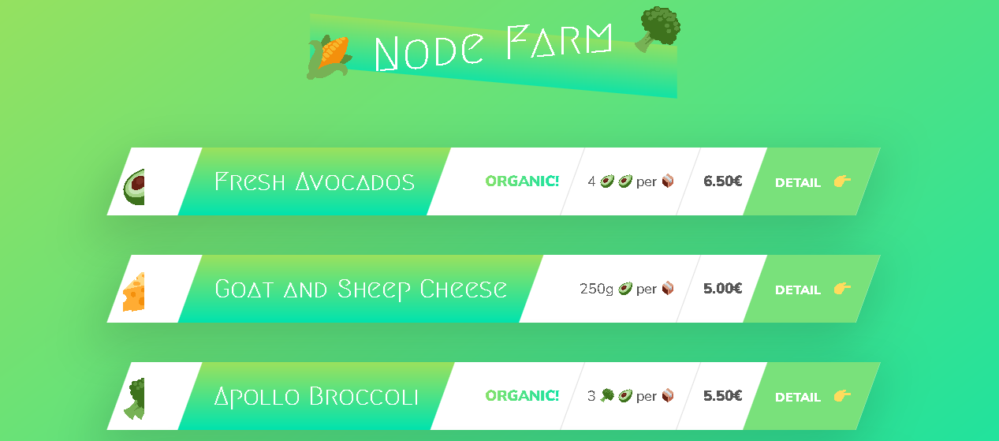

# 🌱 Node Farm

Node Farm is a small project built with **Node.js** to display farm products dynamically.  
It demonstrates how to create a simple server, handle routes, and render product data on a webpage.

---

## 📸 Project Preview

---

## 🚀 Features

- Built with **pure Node.js** (no external frameworks).
- Dynamic product listing (Avocados, Cheese, Broccoli, etc.).
- Product detail pages.
- Example of working with **JSON data** and rendering templates.
- Styled with CSS for a fresh and clean look.

---

## 📂 Project Structure

📦 node-farm
┣ 📂 dev-data
┃ ┗ data.json # Products data
┣ 📂 templates
┃ ┣ overview.html # Products overview page
┃ ┣ product.html # Product detail page
┃ ┗ card.html # Product card
┣ 📂 modules
┃ ┗ replaceTemplate.js # Custom module to replace placeholders in templates with product data
┣ index.js # Main Node.js server
┗ README.md